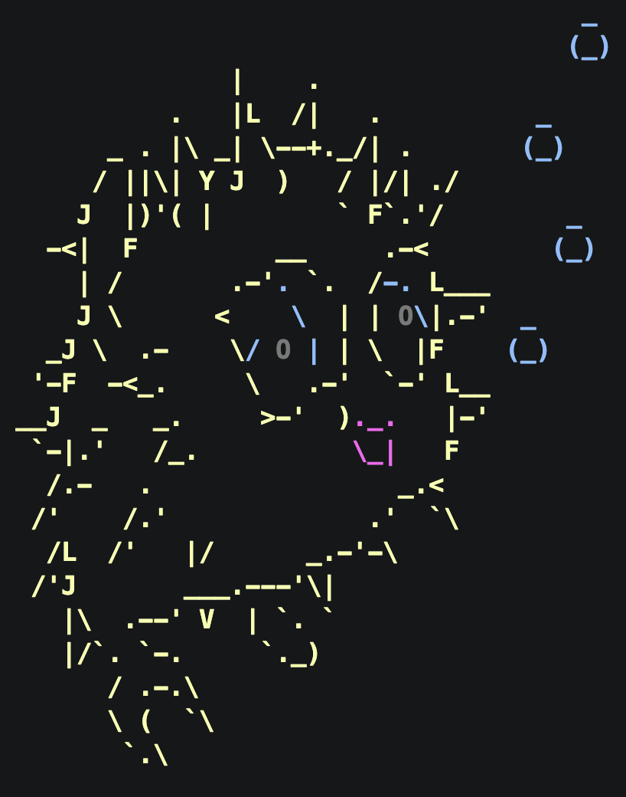

<div align="center">
  
</div>

# openbsd-configs

OpenBSD dotfiles for ThinkPad. i3 WM, zsh, alacritty.

## Quick start

```sh
git clone <repo> ~/openbsd-configs
cd ~/openbsd-configs
make all        # install packages + zsh + minimal profile + system
```

## Profiles

Two i3 profiles are available:

**minimal** — i3bar, no compositor. Fast, works on weak hardware.
```sh
make link-minimal
```

**rice** — Catppuccin Mocha theme, picom (shadows + rounded corners), polybar, dunst notifications.
```sh
make link-rice
```

After switching profiles restart i3 with `Mod+Shift+r`.

## Make targets

| Target | What it does |
|---|---|
| `make all` | packages + os + zsh + minimal profile + system |
| `make packages` | install base packages via pkg_add |
| `make link-minimal` | symlink minimal profile configs |
| `make link-rice` | symlink rice profile configs (installs picom/polybar/dunst) |
| `make system` | link xenodm configs (requires doas) |
| `make xenodm` | system + restart xenodm |
| `make zsh` | install oh-my-zsh + autosuggestions, set default shell |
| `make os` | set hostname to `thinkpad`, timezone to Europe/Moscow |
| `make firefox` | write user.js to active Firefox profile |
| `make awg` | build and install AmneziaWG from source |
| `make awg-script` | install awg-openbsd helper to /usr/local/bin |
| `make claude` | install Claude Code via npm |
| `make clean` | remove all symlinks and oh-my-zsh |

## File structure

```
home/
  .zshrc                         zsh + oh-my-zsh (dieter theme, autosuggestions)
  .xsession                      X session: xscreensaver, keyboard layout, exec i3
  .xscreensaver                  screensaver config
  .config/
    i3/
      config                     rice i3 config
      config.minimal             minimal i3 config
      i3status.conf              status bar for minimal profile
    alacritty/alacritty.toml     terminal (Catppuccin Mocha)
    picom/picom.conf             compositor: shadows, fading, rounded corners
    polybar/
      config.ini                 bar: workspaces, cpu, ram, battery, date
      launch.sh                  polybar restart helper (called from i3 exec)
    dunst/dunstrc                notifications (Catppuccin)
    rofi/config.rasi             app launcher (Catppuccin)
  .mozilla/firefox/user.js       hardcoded Firefox preferences

system/
  xenodm/Xresources              xenodm login screen styling
  xenodm/Xsetup_0                xenodm pre-login setup (background, fonts)

scripts/
  awg-openbsd.sh                 AmneziaWG userspace client (start/stop/status/restart)
```

## Keybindings

| Key | Action |
|---|---|
| `Mod+Enter` | alacritty |
| `Mod+d` | rofi launcher |
| `Mod+l` | lock screen |
| `Mod+Shift+s` | screenshot selection → clipboard |
| `Mod+Shift+q` | close window |
| `Mod+Shift+e` | exit i3 |
| `Mod+Shift+r` | restart i3 |
| `Mod+Shift+c` | reload i3 config |
| `Mod+arrows` | focus window |
| `Mod+Shift+arrows` | move window |
| `Mod+r` | resize mode |
| `Mod+f` | fullscreen |
| `Mod+h/v` | split horizontal/vertical |
| `Mod+1-0` | switch workspace |
| `Mod+Shift+1-0` | move window to workspace |
| `XF86AudioRaiseVolume` | volume +5 |
| `XF86AudioLowerVolume` | volume -5 |

## AmneziaWG VPN

Userspace WireGuard with obfuscation. Build dependencies: go, gmake.

```sh
make awg          # build and install amneziawg-go + amneziawg-tools
make awg-script   # install awg-openbsd to /usr/local/bin

awg-openbsd --config /etc/amnezia/amneziawg/wg0.conf start
awg-openbsd --config /etc/amnezia/amneziawg/wg0.conf stop
awg-openbsd --config /etc/amnezia/amneziawg/wg0.conf status
awg-openbsd --config /etc/amnezia/amneziawg/wg0.conf restart
```
